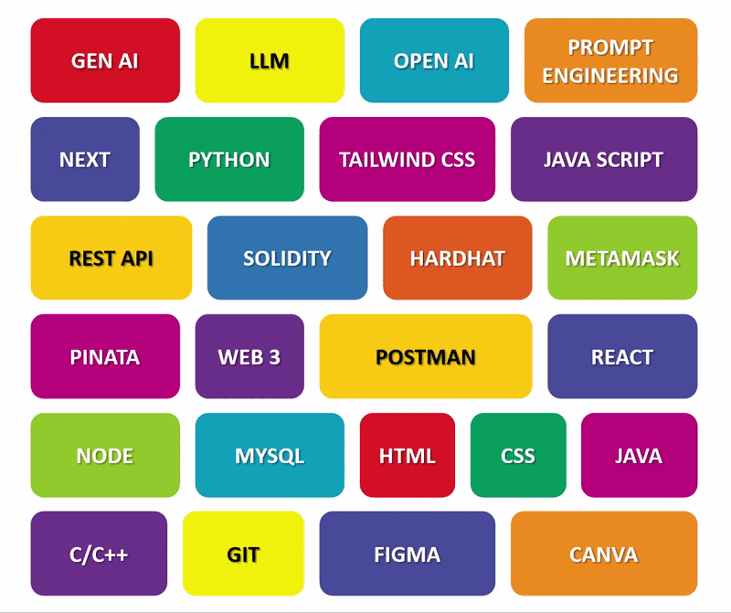

#  ɪ'ᴍ PRAGYA! 

  <ul>
    

      <h1 align="left"> About Me </h1>
      <picture>
        <source media="(prefers-color-scheme: dark)" srcset="./space1.png">
        <source media="(prefers-color-scheme: light)" srcset="./space2.png">
        
      </picture>
      <h1 align="right"> My Toolkit </h1>
    

  </ul>

  <!--💼 SKILLS-->
  <picture>
    <source media="(prefers-color-scheme: dark)" srcset="./dark.gif">
    <source media="(prefers-color-scheme: light)" srcset="./light.gif">
    
  </picture>

  <!--✨ ABOUT-->
  

    
I'm a Post-Graduate from VIT, Chennai, with a strong foundation in full-stack development and a passion for building intelligent, user-centric web applications using LLMs and modern frameworks.

  

- 🚀 Currently building with **Next.js** and **LLMs** 
- ✨ Obsessed with **AI-powered user experiences** and **decentralized tech** 
- 🎯 Always learning, building, and leveling up

  

<!--📞CONTACT-->

  <ul>
    

      <h2>🤝Connect With Me</h2>
    

  </ul>
  
  
  
  
  
  <!---->
  
  
  
  

 

<!--📈STATS-->

  
  
  

 

<!--🏆TROPHIES-->

<picture>
      <source media="(prefers-color-scheme: dark)"  srcset="https://github-profile-trophy.vercel.app/?username=psatakshee&no-bg=true&no-frame=true&theme=flat">
      <source media="(prefers-color-scheme: light)" srcset="https://github-profile-trophy.vercel.app/?username=psatakshee&no-bg=true&no-frame=true&theme=flat">
      
</picture>

